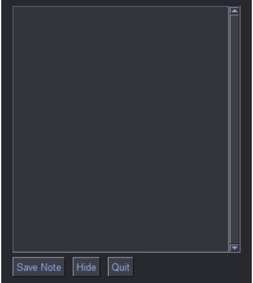

# QuickNote

**QuickNote** is a lightweight Python-based application for taking notes and tracking keyboard and mouse activity. It provides a simple and intuitive user interface for managing notes and logging events, with the ability to toggle the visibility of the note-taking window. 

---

## Features

- **Dark-Themed Note-Taking Window**:
  - Multiline input area for notes.
  - Buttons to save notes, hide the window, and quit the application.
  - Persistent storage of notes with timestamps.

- **Event Tracking**:
  - Logs all keyboard and mouse activities to a tracker file (`Tracker.txt`).
  - Tracks the usage of the note window (e.g., visibility toggles, saves, etc.).

- **File Management**:
  - Automatically hides the tracker log file after the application closes.
  - Ensures directories for saving notes and logs exist.

- **User-Friendly Interface**:
  - Toggle button for showing and hiding the note window.
  - Resizable, draggable windows.
  - Transparency effect for an unobtrusive experience.

- **Cross-Platform GUI**:
  - Built using `PySimpleGUI` for an accessible and customizable interface.

---

## Requirements

To run the application, you need the following:

- Python 3.8 or higher
- Required Python libraries:
  - `PySimpleGUI`
  - `pynput`

Install the dependencies using:

```bash
pip install PySimpleGUI pynput
```
---

# File Structure
## The application uses the following paths for storing data:

- Notes: Stored in `D:\NX_BACKWORK\Database_File\Process_QuickNOTE\Note.txt`
- Activity Logs: Stored in `D:\NX_BACKWORK\Database_File\Process_QuickNOTE\Tracker.txt`
- If the directories do not exist, they will be automatically created when the application is run.

---

# Usage
## Running the Application
- Save the Python script as `QuickNote.py.`
- The toggle button will appear at the bottom-right of the screen. Click the button to show or hide the note-taking window.

---

# Buttons in the Note Window.
- Save Note: Saves the current note with a timestamp in Note.txt.
- Hide: Hides the note window and saves the note.
- Quit: Closes the application.

---

# Deployment
## To create an executable:
- Install PyInstaller:
```bash
pip install pyinstaller
```
## Use the following command to generate a standalone executable:
```bash
pyinstaller --onefile --noconsole QuickNote.py
```
## Optionally, add a custom icon:
```bash
pyinstaller -F -i "QN.ico" --onefile --noconsole QuickNote.py
```
---

# Logging
- All events (keyboard/mouse interactions, window actions) are logged in Tracker.txt.
- The tracker file is hidden upon closing the application for privacy.

---

## GUI Features:

- A toggle button (arrow_window) allows the user to show or hide the note-taking window (note_window).
  
    
  
- The note window includes a multiline text area, "Save Note," "Hide," and "Quit" buttons.

    


## Event Logging:

- Logs all key presses and mouse clicks into a tracker file (Tracker.txt).
- Saves notes to a separate file (Note.txt) with timestamps.

## File Management:

- Ensures required directories exist.
- Automatically hides the tracker file after the application closes.

## Cross-Window Communication:

- Uses PySimpleGUI to manage and handle events from multiple windows.

## Utility:

- Can be compiled into an executable using PyInstaller for deployment.
# MIT License
- This project is licensed under the MIT License. See the LICENSE file for more information.

---

# Credits
Developed by Bala Ganesh.
Version: v0.1.0
Year: 2024

```vb
You can customize this file as needed or expand it with additional sections. Let me know if you'd like assistance creating a specific section! 😊
```
